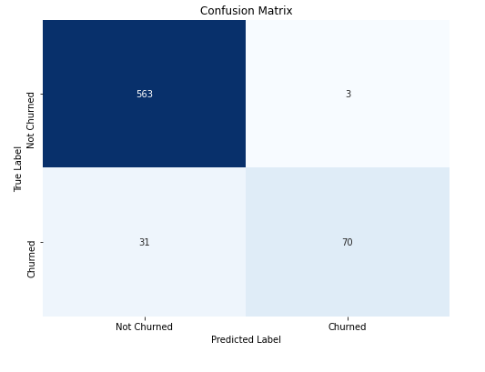
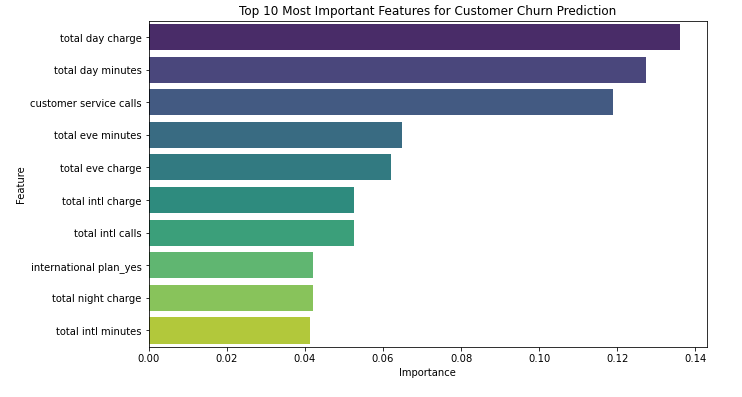
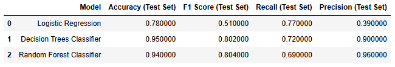
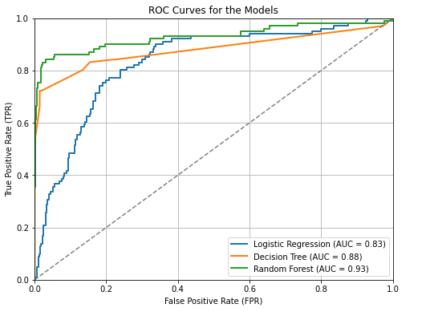

# Customer Churn Analysis: Predicting Customer Retention at SyriaTel Mobile Telecom using Machine Learning

## Project Overview
This project aims to develop a binary classification model to predict customer churn for SyriaTel, a telecommunications company facing challenges with customer retention.

Through this project, we are building a prediction model that identifies patterns in customer churning, which can be helpful in developing mitigation strategies. The insights derived from this predictive analysis will enable SyriaTel to implement targeted retention strategies, ultimately reducing revenue loss associated with customer attrition. This initiative not only seeks to enhance customer loyalty but also to empower the company with data-driven decision-making capabilities to foster long-term relationships with its clientele.

## Business Understanding
### Stakeholders
The primary stakeholders in this project are the management and marketing teams at SyriaTel, who are keenly interested in understanding and addressing the issue of customer churn.

#### Business Problem
The primary business problem is to predict whether a customer is likely to "soon" stop doing business with SyriaTel. By identifying customers at risk of churning, SyriaTel can implement targeted interventions to improve customer satisfaction and loyalty, ultimately reducing churn rates and enhancing profitability.

## Research objectives
Our key objectives are:
1. Create and validate a predictive model to accurately identify customers who are likely to churn in the near future, using historical customer data and relevant features.
2. Analyze customer data to identify the key factors and behaviors that contribute to the likelihood of churn.
3. Design and implement targeted interventions for identified at-risk customers, and assess the effectiveness of these interventions in improving customer satisfaction and reducing churn rates.

## The Data
### Data Understanding
The SyriaTel Customer Churn dataset is from Kaggle and can be found in the data folder. The dataset contains 3333 entries and 21 columns. This dataset contains information about customers of a telecom company, including their state, account length, area code, phone number, and whether they have international and voice mail plans. The dataset also includes information about the number of voicemails the customer has sent, the total number of minutes, calls, and charges for day, evening, and night calls, as well as the total number of minutes, calls, and charges for international calls. Additionally, the dataset includes information about the number of calls the customer has made to customer service.

### Data Cleaning
We checked for missing values and duplicated values but found none. We then proceeded to drop unnecessary columns and remained with columns that would be useful to our analysis.

#### Exploratory Data Analysis
This process involved a series of examining the distribution of variables, identifying patterns, and uncovering relationships between variables. This includes visualizing distributions, and analyzing correlations between numerical variables, as well as examining the distribution of categorical variables and the target variable (churn). The goal was to understand the relationships between variables such as account length, usage patterns, and customer service interactions, and how they relate to the likelihood of churn, ultimately informing feature engineering and modeling decisions to improve the accuracy of the churn prediction model.

#### Data Preprocessing
Feature Engineering: Certain columns were transformed to enhance their usefulness. This included; Encoding categorical variables into numerical representations e.g area_code, international_plan, voice_mail_plan Normalization and Scaling features to a consistent range using the StandardScaler.
We then split the data into different sets, training and testing sets. The training set was used to train the different models and then we used the test data for evaluation of performance.
By performing these steps, we aimed to gain a comprehensive understanding of the dataset and prepare it for further analysis and modeling.

## Modeling
We created several models, evaluated them, and did some hyperparemeter tuning where it was necessary to try and improve the models. Our goal was to find the model and parameters that performed the best.
We developed and evaluated three classification models to gain insights and make predictions. Here is an overview of the models:

### Model 1: Logistic Regression Model
The first logistic regression model was built using default parameters. The model accrued 86% training accuracy and 86% for test accuracy. The recall was 18%, precision 60% and 27% F1 Score.
#### Logistic Model Addressing Class Imbalance
We tried to improve the model performance by addressing class imbalance using class weight ‘balanced’. Train Accuracy was 0.77, test accuracy 0.78. The precision was 39%, recall 77% and an F1 score of 51%. This was the selected model for logistic regression.

### Model 2: Decision Tree Classifier
The baseline model used the default parameters to train and test the model. The train score was 1 indicating the model was overfitting and a test score of 0.91. The model has an accuracy of 0.91, precision of 0.71, recall of 0.75 and an F1 score of 0.73.
#### Improving the model using SMOTE
We tried to improve the baseline model by addressing class imbalance using SMOTE. After including SMOTE, the model had a train score of 1.0 where it was still overfitting and a test score 0.89. The accuracy was 0.89, precision 0.63, recall 0.76 of and an F1 score of 0.69.
#### Improving the model using GridSearchCV
We tried to further improve the model by using GridSearchCV to get the best hyperparameters. We also included 5-fold cross validation to deal with overfitting. The model performed fairly well with a train score of 0.96 and a test score of 0.94. The accuracy was 0.94, precision 0.90, recall 0.73 and an F1 score 0.80. This was the best decision tree classifier model.

### Model 3: Random Forest Classifier
We used this model to predict customer churn.  It analyzes customer behavior and key features to determine the likelihood of customers leaving the service. The Random Forest model is chosen for its accuracy and ability to handle complex relationships in the data.

Baseline Results
Accuracy: 0.9445277361319341
Precision: 0.9210526315789473
Recall: 0.693069306930693
F1-score: 0.7909604519774012
Train score: 1.0
Test score: 0.9445277361319341
The Random Forest model seems to have performed well in predicting churn and not churned customers based on previous models. It achieved high accuracy, precision, and recall scores, indicating that it is effective in identifying churned customers while minimizing false positives. However, we needed to address the overfitting issue.
#### Using k-fold cross validation to address overfitting
To address overfitting, K-fold cross-validation was employed for the Random Forest model. This technique helps assess the model's robustness and generalization by splitting the data into K subsets and iteratively training and testing the model on different combinations.

Random Forest with k-fold cross-validation results
Cross-Validation Accuracy: 0.943736605041072
Precision: 0.958904109589041
Recall: 0.693069306930693
F1-score: 0.8045977011494252
Train score: 0.977119279819955
Test score: 0.9490254872563718
the Random Forest model seems to perform well overall in predicting customer churn based on the given dataset. It achieved high accuracy and precision, indicating it correctly classified a significant portion of churned and not churned customers.

#### Confusion matrix

#### Feature Importance
The top 10 most important features of the random forest model

#### Comparison to choose the best model

Based on the provided metrics, the Decision Trees Classifier achieved the highest F1-score (81.00%). The logistic regression had the highest recall (73.00%), while the Random Forest Classifier achieved the highest precision (96.00%). The Random Forest Classifier is the best-performing model overall and so we selected it as our best model.

#### ROC and AUC curves

The ROC curves for Logistic Regression, Decision Tree, and Random Forest models were analyzed. The Random Forest model outperformed the others, showing a higher Area Under the Curve (AUC) and better classification performance, making it the most effective model

## Conclusion and Recommendations
In conclusion, the analysis demonstrates that we can effectively predict customer churn using a machine learning model, with the Random Forest Classifier being the preferred choice due to its great overall performance. This model demonstrates the best results, as evidenced by its ROC curve, which closely follows the upper left corner of the graph, resulting in the highest AUC (Area Under the Curve).

1. As the main model for predicting loss of clients, I would advise Syriatel to use the Random Forest Classifier. This model is well-suited for correctly identifying consumers as likely or unlikely to churn because it has a higher ROC curve and great overall performance in terms of accuracy, F1-score, recall, and precision on the test set.
2. Since the analysis shows that an increase in customer service calls correlates with a higher likelihood of churn, it is crucial to address customer concerns effectively. I would advise SyriaTel to consider training customer service representatives to handle issues more efficiently and empathetically. Additionally, I would recommend them to explore the use of customer feedback mechanisms to identify and resolve pain points before they lead to churn.
3. The analysis also shows that total day and evening charge has a high impact on churn. I would recommend that SyriaTel review and adjust the pricing structure for total day charges to ensure competitiveness and transparency, as well as implement flexible plans that incentivize evening usage, such as discounts or bonus minutes for calls made during off-peak hours. This approach will help reduce customer dissatisfaction with charges while encouraging usage during less busy times, ultimately enhancing customer retention.
